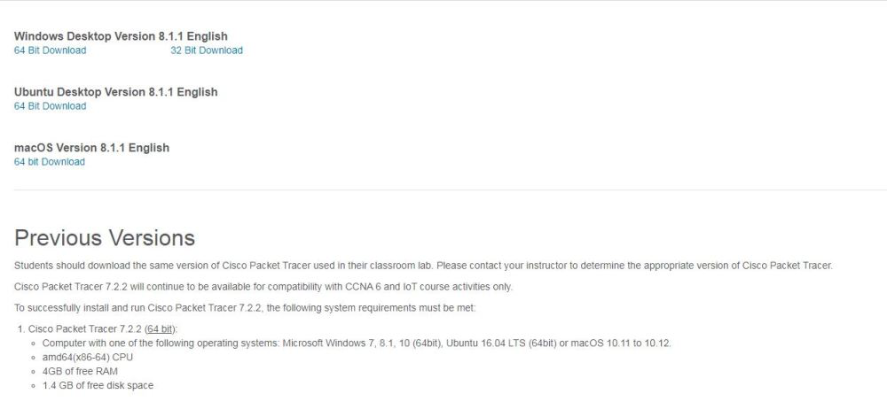
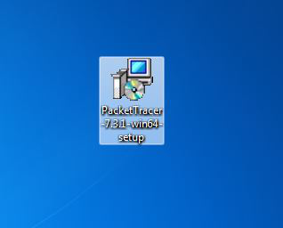

#Installing Packet Tracer on Windows

**Step 1:** Visit the official website of [Netacad][1] using any web browser.

[1]: <https://www.netacad.com/>

**Step 2:** Press the login button and select log In option.

**Step 3:** Next screen will appear, click on the sign-up option.

**Step 4:** Next screen will appear and will ask for email and password and other simple details, fill them and click on Register.

**Step 5:** Now the login screen appears again so fill in the Email id.

**Step 6:** On the next screen enter the password and press the Login button.

**Step 7:** Dashboard will initialize, now click on Resources and choose Download Packet Tracer Option. 

**Step 8:** On the next web page choose the operating system to download the packet tracer. Downloading will start automatically.

**Step 9:** Check for the executable file in your system and run it.

